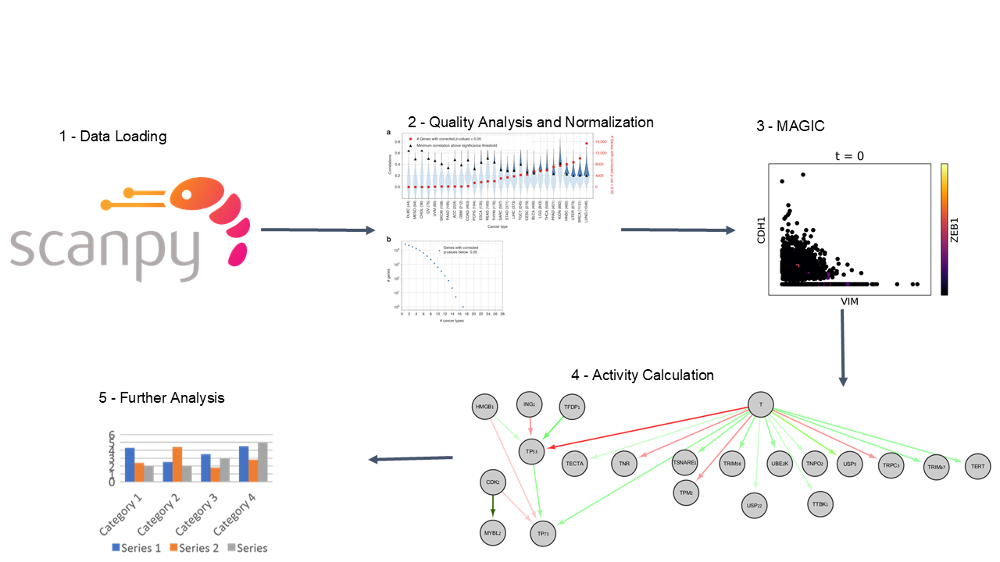

# PathSingle: A Biochemical Pathway Analysis Tool for Single-Cell Data


## Overview
PathSingle is a Python-based pathway analysis tool tailored for single-cell data analysis. It employs a unique graph-based algorithm to enable the analysis of diverse cellular states, such as T cell subtypes. Designed to be open-source, extensible, and computationally efficient, PathSingle provides researchers with a versatile framework for uncovering biologically meaningful insights from high-dimensional single-cell transcriptomics data.

## Key Features
- Tailored for single-cell RNA-seq data analysis
- Unique graph-based algorithm for pathway analysis
- Efficient classification of diverse cellular states
- Open-source and extensible
- Computationally efficient

## Installation
Simply clone this repository using git clone command.

## Quick Start
```
anndata = sc.read('./data/activity_df.csv', delimiter=',', cache=False)
calc_activity(anndata)
```

## Usage
For detailed usage instructions, please refer to the notebooks in the `code` folder, which demonstrate single-cell RNA-seq data processing using PathSingle.

The `pathway_db` subfolder contains scripts for building and customizing the pathways database.

## Supported Pathways
PathSingle currently supports 357 curated pathways. Click the link to view the full list. [List of supported pathways.](data/pathway_relations.csv)

## Contributing
We welcome contributions! Please see our Contributing Guidelines for more information on how to get involved.

## License
PathSingle is available under the MIT license. See the LICENSE file for more details.

## Support
For questions, issues, or feature requests, please open an issue on our GitHub repository.

For additional support, contact: zurkin at yahoo dot com

## Acknowledgments
We thank the scientific community for their valuable feedback and contributions to this project.